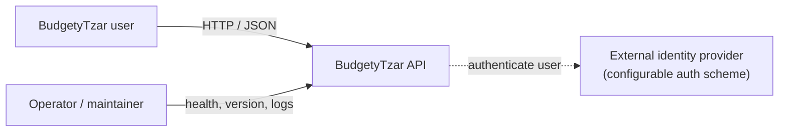
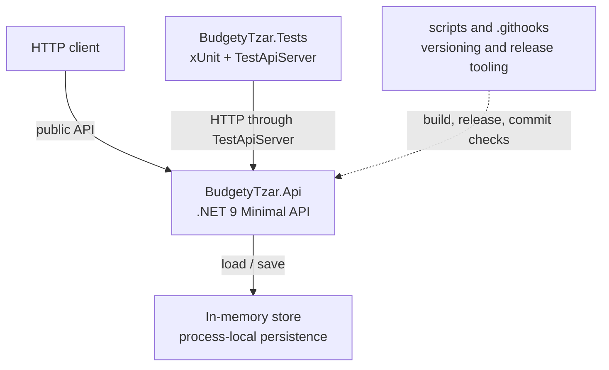
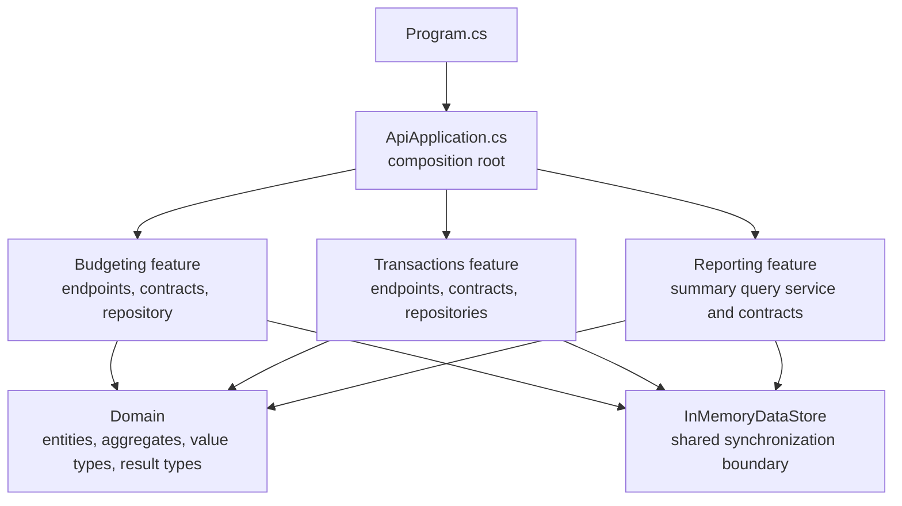
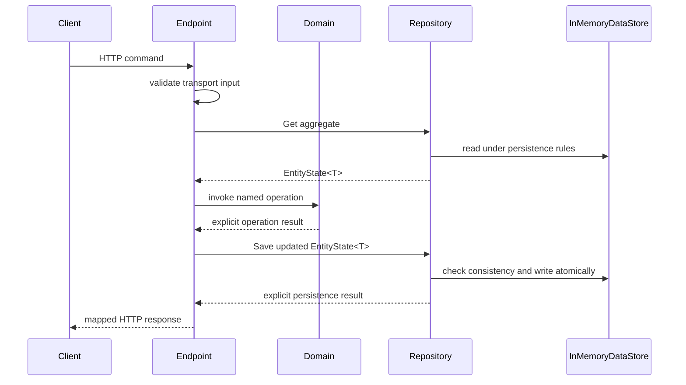
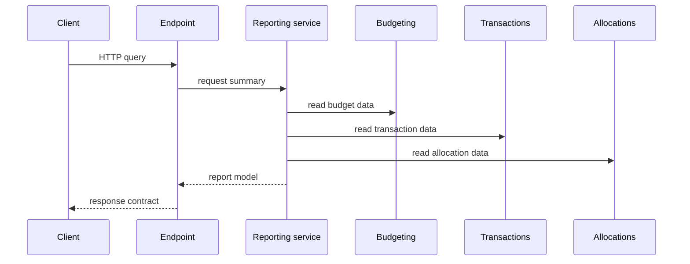

# Architecture

This guide explains where code belongs and why. It describes the implementation
structure rather than defining product behaviour or coding style.

BudgetyTzar is currently a modular monolith: one .NET 9 Minimal API process, one
in-memory persistence boundary, and one xUnit test project. The design keeps feature
boundaries explicit without introducing extra deployable services before there is a
product or operational reason for them.

## System Context

The API owns the budgeting workflows. Authentication is handled through configured
ASP.NET Core authentication schemes. The application derives an internal application
user identity from authenticated claims, but it does not implement password storage,
registration, or identity-provider deployment.

Authentication resolves identity. It does not own the domain-specific access rules for
budgets, transactions, allocations, reports, or audit records. Those rules live with
the boundary that owns the resource language.

## Containers

The production container runs only `BudgetyTzar.Api`. Tests and scripts are separate
executable parts of the repository, but not deployed application services.

Persistence is intentionally in memory today. The observable behaviour should survive
a future database implementation, with transactions, constraints, and concurrency
tokens replacing the current lock and dictionaries.

## API Component Model

Feature folders own the HTTP endpoints, request and response contracts, handler
coordination, and persistence adapters for their use cases. Keeping those files
together makes a vertical slice easy to review and prevents a small API from becoming
layered by folder ceremony rather than responsibility.

Shared domain types live under `Domain` because Budgeting, Transactions, Allocations,
and Reporting use the same ubiquitous language and invariant-protecting values.
Domain code does not depend on endpoints, repositories, ASP.NET Core, or storage.

Reporting reads across boundaries because a budget summary combines budgets, budget
items, transactions, and allocations. It does not mutate those boundaries or take
ownership of their data.

## Repository Map

| Path | Responsibility |
| --- | --- |
| `src/BudgetyTzar.Api/Program.cs` | Process entry point. Creates and runs the web application. |
| `src/BudgetyTzar.Api/ApiApplication.cs` | Composition root. Registers services and endpoint groups. |
| `src/BudgetyTzar.Api/Domain/Entities` | Immutable entities, aggregates, operations, and result types. |
| `src/BudgetyTzar.Api/Domain/ValueTypes` | Validated domain values such as names, currencies, money amounts, and kinds. |
| `src/BudgetyTzar.Api/Features/Identity` | Authentication scheme setup, current-user resolution, and stable application user identity. |
| `src/BudgetyTzar.Api/Features/Budgeting` | Budget endpoints, contracts, handlers, and persistence. |
| `src/BudgetyTzar.Api/Features/Transactions` | Transaction and allocation endpoints, contracts, handlers, and persistence. |
| `src/BudgetyTzar.Api/Features/Reporting` | Budget summary query model, calculation service, contracts, and endpoint. |
| `src/BudgetyTzar.Api/Features/InMemoryDataStore.cs` | Shared in-memory state and synchronization boundary. |
| `tests/BudgetyTzar.Tests/Support` | Test-only API host and shared test support. |
| `tests/BudgetyTzar.Tests/<Feature>` | Domain, repository, and API behaviour tests grouped by feature. |
| `SPECIFICATION.md` | Product and system requirements. |
| `CONTRIBUTING.md` | Development workflow plus coding and testing style. |

## Key Request Flows

### Command flow

Handlers coordinate the request. They validate transport input, rely on user-scoped
repositories, call domain or application operations, pass repository-owned state back
to repositories, and map explicit outcomes to HTTP responses. They should not know
how persistence versions, storage locks, database tokens, or owner indexes work.

`EntityState<T>` carries opaque repository-owned concurrency state through
`Get -> domain operation -> Save`. It exists so repositories can enforce stale-write
protection without putting persistence versions on domain entities.

### Query flow

Read models may combine data from several boundaries, but they should stay read-only.
If a query starts enforcing a command rule or changing state, move that responsibility
back to the boundary that owns the language.

## Boundary Ownership

| Boundary | Owns | Why |
| --- | --- | --- |
| Identity | Authentication and resolved current-user identity. | Authentication proves who is making the request; user-facing repositories scope resource access to that internal user identity. |
| Budgeting | Budgets, budget items, and budget access rules. | Budget names, items, planned amounts, and deletion rules use budgeting language. |
| Transactions | Transactions and transaction access rules. | Transactions are real-world financial events and are not children of budgets. |
| Transaction Allocations | Allocation creation, removal, lookup, and allocation access rules. | Allocation is its own relationship between transaction usage and budget planning. |
| Reporting | Budget summary calculations and report response shapes. | Reports combine owned data from other boundaries without mutating it. |
| Audit | Durable change records and audit timelines. | Audit is an architectural concern, not a new concept in the core budgeting model. |
| Web application | User interface and authentication flow. | The frontend should use API responses shaped for user workflows. |

The shared `InMemoryDataStore` is the current persistence boundary. It lets repositories
emulate database-style constraints atomically while the application is in memory. For
example, deleting a budget item and checking whether an allocation references it must
happen under the same synchronization boundary.

Repositories own storage-wide consistency and concurrency state because those rules
depend on stored data, not only on a single aggregate's in-memory state. Aggregates own
the invariants they can decide from their own state.

User-facing repositories are scoped to the current internal application user. Cross-user
access is treated as missing data so the API does not disclose another user's resource
existence. If future admin, migration, support, or background workflows need cross-user
access, give them a separate explicitly user-aware API that requires the target
application user at the call site.

## Before Changing Structure

Keep the implementation and this guide aligned. When responsibilities, request flow,
or persistence boundaries change, update the diagrams, repository map, and ownership
notes in the same pull request.
