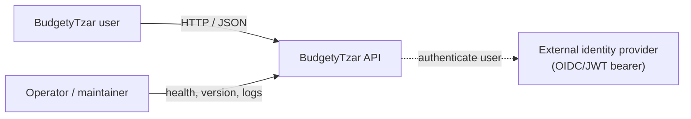
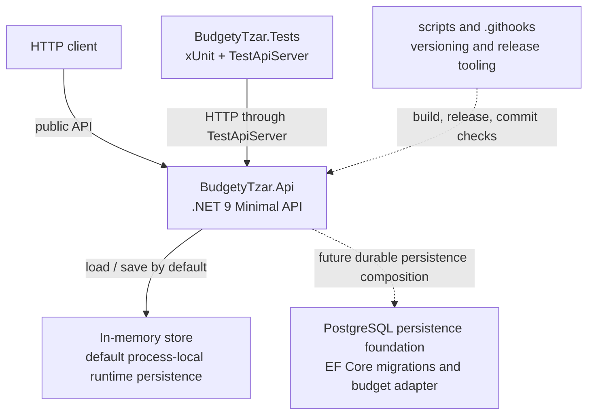
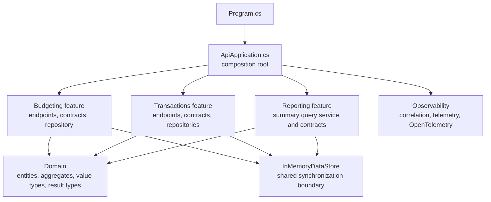
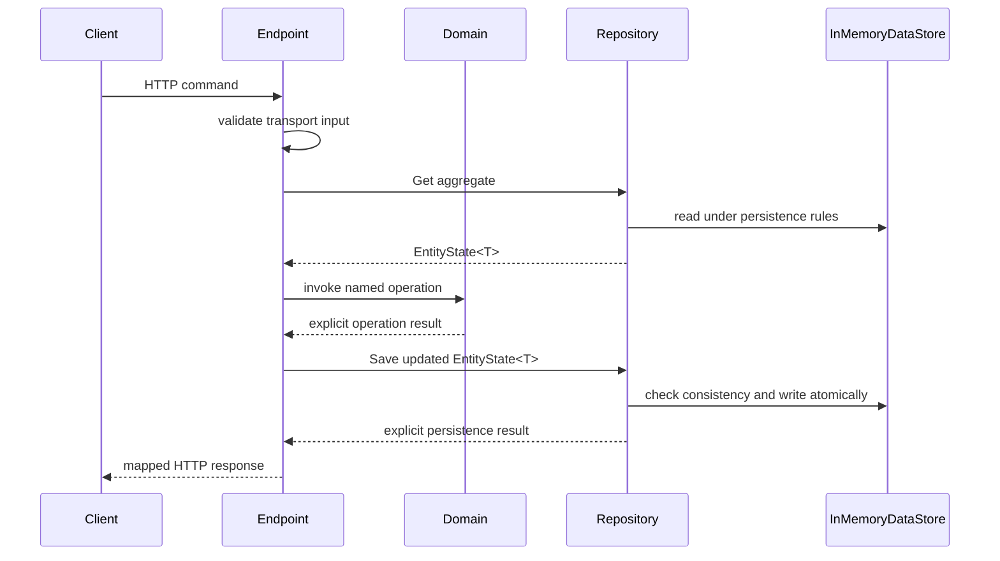
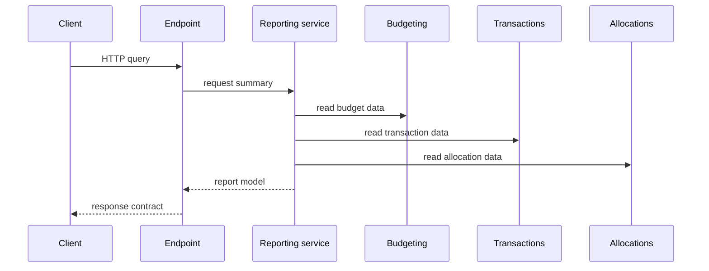

# Architecture

This guide explains where code belongs and why. It describes the implementation
structure rather than defining product behaviour or coding style.

BudgetyTzar is currently a modular monolith: one .NET 9 Minimal API process, one
in-memory default runtime persistence boundary, a PostgreSQL persistence foundation
with a budgeting repository adapter, and one xUnit test project. The design keeps
feature boundaries explicit without
introducing extra deployable services before there is a product or operational reason
for them.

## System Context

The API owns the budgeting workflows. A configured external identity provider is the
production authentication boundary; the application should not implement password
storage or identity management unless the product deliberately changes direction.

Authentication resolves identity. It does not own the domain-specific access rules for
budgets, transactions, allocations, reports, or audit records. Those rules live with
the boundary that owns the resource language.

## Containers

The production container runs only `BudgetyTzar.Api`. Tests and scripts are separate
executable parts of the repository, but not deployed application services.

Runtime persistence defaults to in memory today. The observable behaviour should
survive database-backed implementations, with transactions, constraints, and
concurrency tokens replacing the current lock and dictionaries. The PostgreSQL
foundation captures the durable schema, EF Core/Npgsql plumbing, and feature-owned
adapters as they are introduced without switching the default application composition
away from the in-memory adapters.

## API Component Model

Feature folders own the HTTP endpoints, request and response contracts, handler
coordination, and persistence adapters for their use cases. Keeping those files
together makes a vertical slice easy to review and prevents a small API from becoming
layered by folder ceremony rather than responsibility.

Feature folders also own their persistence contracts. Endpoint handlers and reporting
services depend on the feature-owned contracts, while the current in-memory classes are
adapters that implement those contracts. Contracts should expose only operations needed
by current use cases and should preserve operation-specific outcomes such as duplicate
names, stale state, referential-integrity conflicts, and allocation idempotency.

The Identity feature owns authentication scheme configuration and current-user
resolution from authenticated claims. It provides a rejecting default scheme when no
deployment authentication is configured and a JWT bearer/OIDC-compatible scheme when
deployment configuration supplies the trusted authority or issuer, audience, HTTPS
metadata setting, and stable user-id claim. The external identity value is a lookup key
for an internal `ApplicationUserId`; it is not the application user's primary
identifier. User-facing repositories are scoped to that current internal application
user so handlers can coordinate use cases without manually filtering cross-user data.

Shared domain types live under `Domain` because Budgeting, Transactions, Allocations,
and Reporting use the same ubiquitous language and invariant-protecting values.
Domain code does not depend on endpoints, repositories, ASP.NET Core, or storage.

Reporting reads across boundaries because a budget summary combines budgets, budget
items, transactions, and allocations. It does not mutate those boundaries or take
ownership of their data.

## Repository Map

| Path | Responsibility |
| --- | --- |
| `src/BudgetyTzar.Api/Program.cs` | Process entry point. Creates and runs the web application. |
| `src/BudgetyTzar.Api/ApiApplication.cs` | Composition root. Registers services and endpoint groups. |
| `src/BudgetyTzar.Api/Domain/Entities` | Immutable entities, aggregates, operations, and result types. |
| `src/BudgetyTzar.Api/Domain/ValueTypes` | Validated domain values such as names, currencies, money amounts, and kinds. |
| `src/BudgetyTzar.Api/Features/Identity` | Authentication configuration, authenticated claim resolution, and current-user identity. |
| `src/BudgetyTzar.Api/Features/Budgeting` | Budget endpoints, HTTP contracts, persistence contracts, handlers, and persistence adapters. |
| `src/BudgetyTzar.Api/Features/Transactions` | Transaction and allocation endpoints, HTTP contracts, persistence contracts, handlers, and persistence adapters. |
| `src/BudgetyTzar.Api/Features/Reporting` | Budget summary query model, calculation service, contracts, and endpoint. |
| `src/BudgetyTzar.Api/Features/InMemoryDataStore.cs` | Shared in-memory state and synchronization boundary. |
| `src/BudgetyTzar.Api/Persistence/PostgreSql` | EF Core DbContext, storage records, migrations, and PostgreSQL-backed feature adapters. |
| `src/BudgetyTzar.Api/Observability` | Correlation ID middleware, low-cardinality API telemetry, and OpenTelemetry composition. |
| `tests/BudgetyTzar.Tests/Support` | Test-only API host and shared test support. |
| `tests/BudgetyTzar.Tests/<Feature>` | Domain, repository, and API behaviour tests grouped by feature. |
| `SPECIFICATION.md` | Product and system requirements. |
| `CONTRIBUTING.md` | Development workflow plus coding and testing style. |

## Key Request Flows

### Command flow

Handlers coordinate the request. They validate transport input, call domain or
application operations, pass repository-owned state back to repositories, and map
explicit outcomes to HTTP responses. They should not know how persistence versions,
storage locks, or database tokens work.

`EntityState<T>` carries opaque repository-owned concurrency state through
`Get -> domain operation -> Save`. It exists so repositories can enforce stale-write
protection without putting persistence versions on domain entities.

### Query flow

Read models may combine data from several boundaries, but they should stay read-only.
If a query starts enforcing a command rule or changing state, move that responsibility
back to the boundary that owns the language.

## Boundary Ownership

| Boundary | Owns | Why |
| --- | --- | --- |
| Identity | Authentication and resolved current-user identity. | Authentication proves who is making the request; domain boundaries decide what that user may do with their resources. |
| Budgeting | Budgets, budget items, and budget access rules. | Budget names, items, planned amounts, and deletion rules use budgeting language. |
| Transactions | Transactions and transaction access rules. | Transactions are real-world financial events and are not children of budgets. |
| Transaction Allocations | Allocation creation, removal, lookup, and allocation access rules. | Allocation is its own relationship between transaction usage and budget planning. |
| Reporting | Budget summary calculations and report response shapes. | Reports combine owned data from other boundaries without mutating it. |
| Audit | Durable change records and audit timelines. | Audit is an architectural concern, not a new concept in the core budgeting model. |
| Web application | User interface and authentication flow. | The frontend should use API responses shaped for user workflows. |

The shared `InMemoryDataStore` is the current persistence boundary. It lets repositories
emulate database-style constraints atomically while the application is in memory. For
example, deleting a budget item and checking whether an allocation references it must
happen under the same synchronization boundary.

The PostgreSQL persistence foundation owns storage records, migrations, and durable
adapters for current operational data. It models application-user ownership in
storage, monetary precision, foreign keys, uniqueness, ordering, and lookup indexes.
Domain entities, endpoint handlers, reporting contracts, and HTTP contracts must
remain free of EF Core, Npgsql, database tokens, and owner identity fields.

Repositories own storage-wide consistency and concurrency state because those rules
depend on stored data, not only on a single aggregate's in-memory state. Aggregates own
the invariants they can decide from their own state.

Persistence contracts sit between feature orchestration and adapters. A new adapter
must implement the relevant feature contracts without leaking database tokens, storage
versions, identity shortcuts, or provider-specific concepts into handlers, domain
entities, reporting services, or HTTP contracts. `EntityState<T>` remains the opaque
carrier for repository-owned concurrency state through `Get -> domain operation ->
Save`.

User-facing operations are scoped to the current internal application user. In the
in-memory implementation, repositories store owner mappings separately from domain
entities and return non-disclosing misses for resources owned by another user. If
future admin, migration, support, or background workflows need cross-user access, give
them a separate explicitly user-aware API that requires the target application user at
the call site.

## Before Changing Structure

Keep the implementation and this guide aligned. When responsibilities, request flow,
or persistence boundaries change, update the diagrams, repository map, and ownership
notes in the same pull request.
